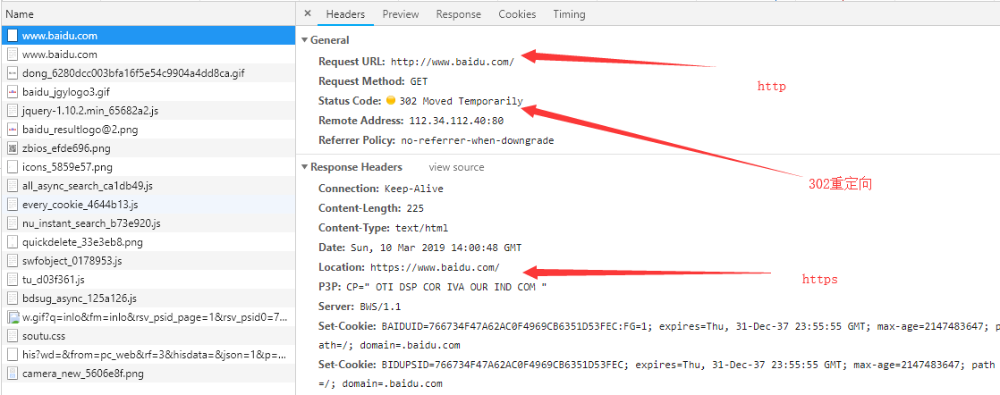
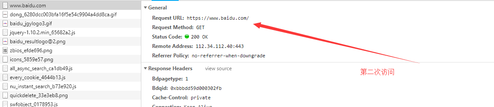

<a name="968aa9a1"></a>

### 起因

由于业务上的要求，需要让客户强制的使用HTTPS连接，当一听到这个名词的时候，我立即想到用302重定向的方式。后来发现这叫 HSTS 连接。
<br/>通过Chrome 浏览器的黑暗模式，尝试访问了百度，并分析了其中的报文。<br/>
<br/><br/>
<br/>很明确发现服务器通过302 重定向，引导浏览器指向了https连接。而在第二次通过 www.baidu.com 的时候，浏览器默认使用了https
连接
<br/>

<br/>
这一部分工作是由浏览器帮用户完成的。通过查询报文发现，response中有一个特殊的字段<br/>`Strict-Transport-Security:max-age=172800`
<br/>正是该字段，确定了https的有效时间，这个时间会随着每次访问而不断的刷新，所以只要用户不是长期的不访问网站，浏览器都会默认的使用https,进而极大的减少了中间人劫持的风险。
<a name="65dc33bd"></a>

### Nginx配置

通过摸索，我们已经知道了HSTS的原理，那么我们回到业务本身，当前业务使用的是nginx服务器，只要nginx 80端口配置块加上301 or
302重定向，同时在ssl连接中加入有效期设置Header，就可以完成HSTS。因为浏览器可以帮助我们完成很多步骤。

```shell
server {
# ipv4 地址监听
listen 80 default_server;
# ipv6 地址监听
listen [::]:80 default_server;
server_name _;

# 利用301重定向
return 301 https://$host;
}
```

当然此时还需要在https 配置块中设置 Strict-Transport-Security的失效<br/>

```shell
server {
listen 443 ssl;
server_name;
#在Http 响应header中加入  Strict-Transport-Security
add_header Strict-Transport-Security "max-age=31536000; includeSubDomains" always;
}
```

此时便大功告成。通过浏览器访问即可发现和访问百度一样的效果
<a name="433531fd"></a>

### 结语

HSTS 方案的确是一种安全通信的保障，通过浏览器和服务器的协作，实现了用户无感知的安全访问。但是这也有一定的缺陷。如果用户清除了浏览器缓存，或者用户更换了浏览器就需要重新的进行302重定向。但是这样也比用户时时刻刻在http下裸奔好。