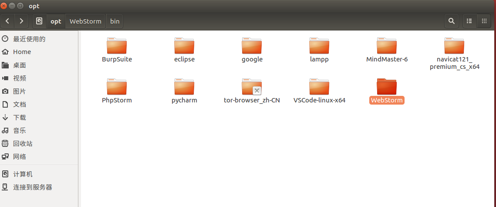

作为一个日常工作都离不开Linux Ubuntu的IT程序员。Linux下很多工具都需要用命令行打开软件。这样还是带来了许多的不便。所以便收集了ubuntu的桌面启动方式修改和定制,一切都只是为了提高效率。这次我们以
WebStorm为例子介绍如何配置自己的桌面快捷方式

### 材料准备

1. WebStorm Linux 启动包
2. icon图标
3. Ubuntu系统

### 安装WebStorm Linux 启动包

其实并不是安装，只是个人习惯。把软件统一的放到一个文件夹下。ubuntu默认是`/opt/`如图


记下 WebStorm的启动脚本路径：`/opt/WebStorm/bin/webstorm.sh`<br />


### 创建*.desktop文件并编辑参数

Ubunut默认的*.desktop文件都放在`/usr/share/applictions/`目录<br />`vim /usr/share/applictions/webstorm.desktop`<br />
复制如下文件

```shell
#!/usr/bin
[Desktop Entry]
Name = WebStorm
Encoding=UTF-8
Comment= WebStorm
Exec=/opt/WebStorm/bin/webstorm.sh
Icon=/opt/WebStorm/bin/webstorm.png
Categories=Application;Development;
Terminal=false
Type=Application
```

保存退出完成，此时我能在Ubuntu自带的dock里搜索到该应用，我们还能将这个文件复制到桌面。方便自己的点击

### 配置名词解释

一下我们对脚本进行解释

| 名称         | 值                        | 解释                                 |
|------------|--------------------------|------------------------------------|
| Name       |                          | 快捷方式显示的名称                          |
| Encoding   | UTF-8                    | 程序运行的编码                            |
| Path       | 脚本第一行                    | 环境变量，需要的运行环境                       |
| Comment    | *                        | 用于dock 搜索索引                        |
| Exec       | 程序路径                     | 程序运行的脚本命令或者路径：eg java -jar xxx.jar |
| Categories | Application;Development; | dock 分类目录                          |
| Icon       | png jpg 路径               | 快捷方式图标                             |


